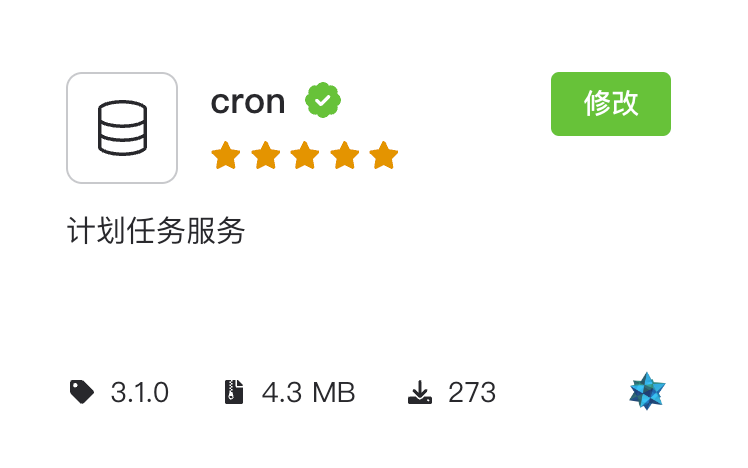
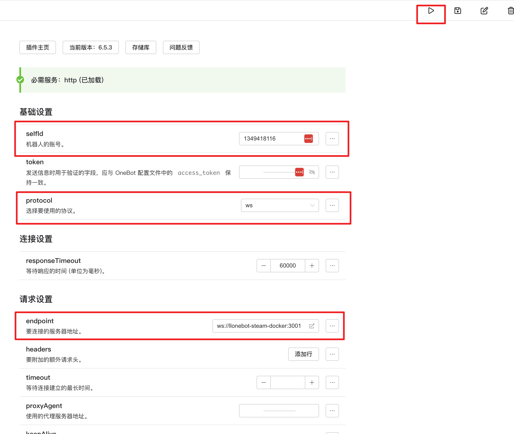
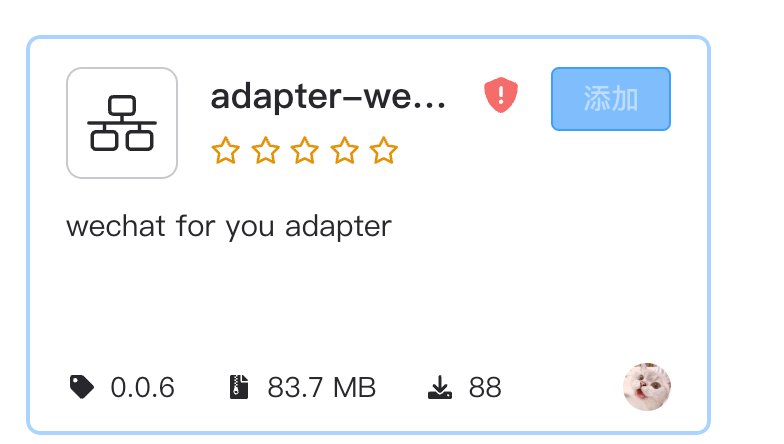
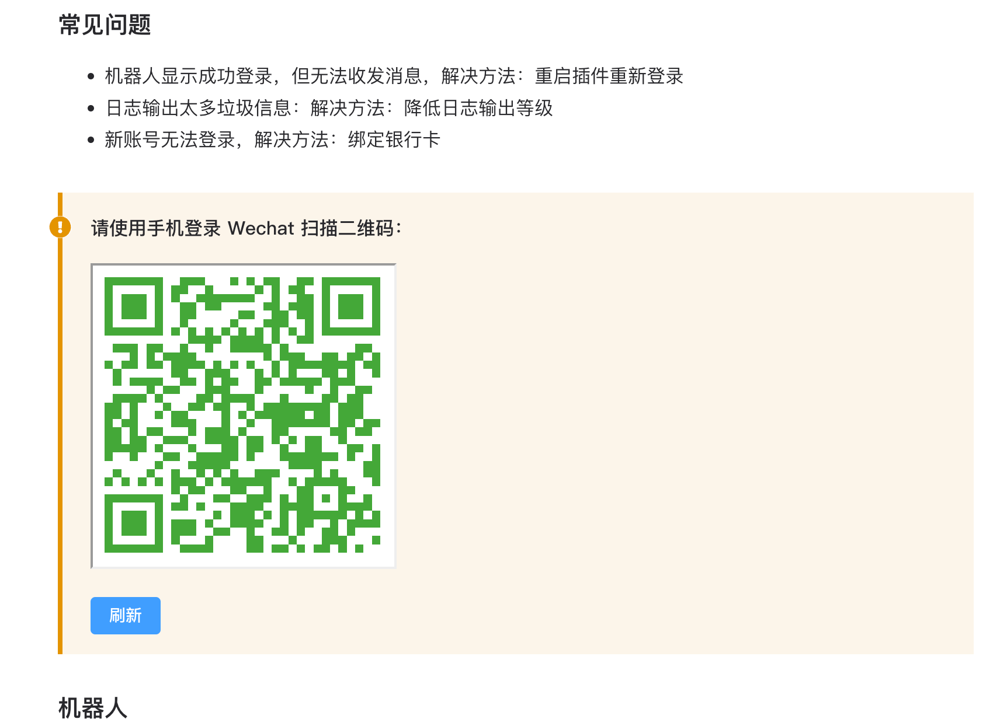
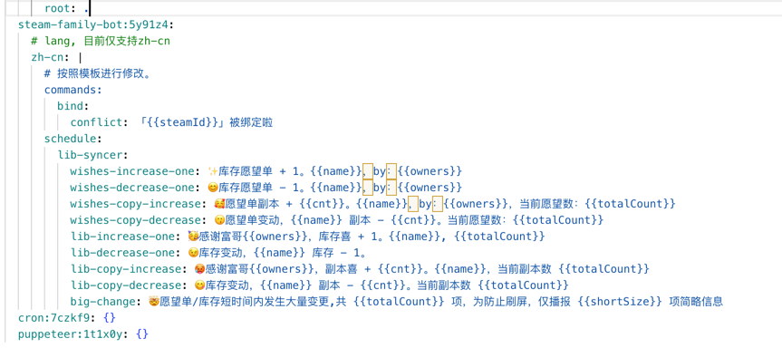

# Steam 家庭库存监控自部署指南

## Prerequisites

1. 需要一个号来充当机器人

### 其他参考文档
- [koishi](https://koishi.chat/zh-CN/manual/starter/)
- [llonebot](https://llonebot.github.io/zh-CN/guide/getting-started)

## QQBot 篇

QQ 官方在前段时间推出了自己的机器人服务。

[qq 官方机器人文档](https://bot.q.qq.com/wiki/)

作为个人开发者，申请流程还是很简单的。

但默认个人开发者的机器人只能给频道用（你也可以给你的家庭组个频道），还是很受限的。

好处是不需要自己提供一个 qq 号作为机器人实例。

因此在这里介绍我正在使用的 onebot，你需要一个 qq 小号来作为机器人。

onebot 是定义了通过网络服务提供 QQ 消息收发能力的一个协议。

[llonebot](https://github.com/LLOneBot/LLOneBot) 则是基于新版 NTQQ 的 onebot 协议实现。

整体结构如下：


不难看出，你需要自行部署 koishi 实例 + llonebot 实例。这里推荐使用 docker compose。
当然你也可以按对应的文档自行部署。
以下为示例 docker compose
```yaml
services:
  koishi-steam:
    image: aktdocker/koishi:v1.20.1
    tty: true
    container_name: koishi_steam
    restart: always
    environment:
      - TZ:"Asia/Shanghai"
    volumes:
      - koishi_steam:/koishi
    ports:
      - "5140:5140"
    networks:
      - steam-bot
  steam-llonebot:
    image: mlikiowa/llonebot-docker:vnc
    tty: true
    container_name: llonebot-steam-docker
    restart: always
    ports:
      - "5900:5900"
      - "3000:3000"
      - "3001:3001"
      - "6099:6099"
    environment:
      - TZ=Asia/Shanghai
      - VNC_PASSWD=vncpasswd
    volumes:
      - llonebot_steam:/opt/QQ/resources/app/LiteLoader
    labels:
      - "traefik.docker.network=traefik"

    networks:
      - steam-bot

volumes:
  llonebot_steam:
  koishi_steam:
networks:
  steam-bot:
    name: steam-bot
```

在启动了 koishi 实例后，打开 http://实例ip:端口，比如 http://127.0.0.1:5140。进入 koishi 控制台。


进入插件市场，下载 adapter-onebot、steam-family-bot、cron 三个插件。



点击配置进行插件配置。

首先启用 cron 插件，他负责为 steam-family-bot 提供定时任务服务。


对于 steam-family-bot 插件，无需额外配置。`libMonitorCron` 是触发 steam 库存检查的时间，默认 15min 一次。


对于 adapter-onebot 插件。

`selfId` 填入充当机器人的 qq 号。

`protocol` 字段选择 `ws`（`ws-reverse`也可用，但需要在llonebot进行额外配置)

在启动了 llonebot 实例后，打开特定地址，此处 127.0.0.1 应当替换为自己的实例地址(如果是本地使用保持 127.0.0.1也ok)，然后打开 `http://127.0.0.1:6099/api/panel/getQQLoginQRcode`

可以看到 QQ 二维码。用上面的qq号扫描即可登陆。

`endpoint` 字段：

如果你是用上面的 docker-compose 文件，那么填入 `ws://llonebot-steam-docker:3001` 就好了。

如果不是，则根据实际情况填入llonebot 实例相对于 koishi 实例的地址。

随后回到 koishi 的 adapter-onebot 的插件设置，启用插件即可。



至此部署完成。

与 qq 机器人对话，按照需要进行登陆，订阅通知即可。

### NapCatQQ

上面的 QQ 是通过 LLonebot 登陆的，另外一个平替是 NapCatQQ。

其优势是内存占用小，但是相对于 llonebot 来说没有图形界面，因此要定制一些配置会更复杂。

对应的 docker-compose 文件如下

```yaml
services:
  koishi-steam:
    image: aktdocker/koishi:v1.20.1
    tty: true
    container_name: koishi
    restart: always
    environment:
      - TZ:"Asia/Shanghai"
    volumes:
      - koishi:/koishi
    ports:
      - "5140:5140"
    networks:
      - steam-bot
  napcat:
    image: mlikiowa/napcat-docker:latest
    environment:
      - ACCOUNT=<改为 Bot 的QQ号>
      - WS_ENABLE=true
    ports:
      - 3001:3001
      - 6099:6099
    container_name: napcat
    volumes:
      - napcat_cfg:/root/.config/QQ
    restart: always
    networks:
      - steam-bot
volumes:
  napcat_cfg:
  koishi:
networks:
  steam-bot:
    name: steam-bot
```


在启动了 llonebot 实例后，查看日志，如果你使用的是 Docker。
使用 `docker logs napcat` 命令可以看到 QQ 二维码。用登陆上面 qq 号的手机扫描即可登陆。

`endpoint` 字段：

如果你是用上面的 docker-compose 文件，那么填入 `ws://napcat:3001` 就好了。

如果不是，则根据实际情况填入 napcat 实例相对于 koishi 实例的地址。

随后回到 koishi 的 adapter-onebot 的插件设置，启用插件即可。

## 微信篇
### 微信 bot 限制

建议先阅读 QQ 篇。

与 上文类似，启动了 koishi 之后，进入插件市场，
安装 **adapter-wechat4u**、steam-family-bot、cron 三个插件。



参照上文在配置好 steam-family-bot、cron 两个插件后，进入 adapter-wechat4u 插件的配置
扫描二维码并登陆微信小号即可。



从原理上来说 这是在模拟 UOS 系统上的桌面微信。

下面是一些坑：
1. 每次重新登陆微信bot，接收到的用户id都会变化，这使得存储用户订阅信息变得不那么可用，因此在重新登陆后，你需要手动更改一些数据，使得通知功能能够继续生效。
   重新登陆并在群聊中发送消息后（推荐安装[inspect 插件](https://koishi.chat/zh-CN/manual/usage/platform.html)），拿到 频道ID(channelId)，bot自身ID(selfId)。


for v0.0.3
将steamFamilyLibSubscribe 表的 channelId,selfId 变更为拿到的最新值。


1. 你需要在一个手机上登陆微信bot账号，不可退出登陆，一旦手机退出登陆微信账号，桌面微信也会被强制退出。因此推荐双开微信。


## i18n

通过合理的插件配置，可以控制对应响应的对应文本

### 示例

在koishi 的插件配置文件中`koishi.yml`，
按照模板添加 language 和自定义文本的键值对，目前文本需要采用严格的string类型的 yaml 格式，因此不方便直接在配置中修改（配置中只支持编辑 json，对于 i18n 场景不如 yaml 方便）如下：



效果如图：


当配置不符合要求时，会在日志中报错，文本会回退为默认文本。

### 插值
形如`{ { param } }` 的内容会被视为参数插槽，发送时会被替换为对应参数（如果有），如果是一个非参数值，则会忽略，但会将 `{ { } }` 移除。

支持形如`{ { subLib ? '✅' : '❌' } }` 的简单的三元表达式，通过 `subLib` 的值决定使用哪一项文本，使得自定义文本更加灵活。

### 模板

```yaml
commands:
  bind:
    conflict: 「{{steamId}}」 已被绑定
    not-steamid: 「{{input}}」似乎不是一个 steamID
    bind-auth: 你当前已经绑定了一个经过验证的账号「{{steamId}}」，目前还不支持多账号绑定。
    bind-success: 成功新增账号绑定「{{steamId}}」
  clear:
    description: clear an auth account relate info
    no-binding: 你还没有绑定 steam 账户，暂时不需要清除数据
    no-auth-binding: 没有找到经过验证的 steam 账户，无需使用 clear 指令。如需清除当前账号，使用 unbind 指令
    clear-success: 清除完成，已移除账户「{{accountName}}({{accountId}})」
  info:
    description: show steam family subscribe info
    no-binding: 你暂未绑定Steam账号，无法获取更多信息
    no-sub-in-channel: 当前账号「{{steamId}}」在该频道暂无订阅信息
    info: |
      家庭「{{familyId}}」订阅信息：
      {{ subLib ? '✅' : '❌' }} 订阅库存信息{{subLib ? '，共计 {{familyLibSize}} 项' : ''}}
      {{ subWishes ? '✅' : '❌' }} 订阅愿望单信息{{subWishes ? '，共计 {{familyWishesSize}} 项' : ''}}
      游戏封面偏好类型：{{preferGameImgType}}
  login:
    description: login to steam via qrcode
    start-login: 请在 120s 内通过 steam 手机验证器扫描二维码，并确认登陆
    login-success-but-add-failed: 登陆出错，数据没能成功新增，可能是因为你目前不在家庭中
    login-success: 登陆成功，你好 {{accountName}}
    timeout: 登陆失败，已超时
    error: 登陆出错，暂时无法登陆
  query:
    keyword-too-long: 为了更精确的找到你要查询的游戏，查询关键词的长度不应小于二，tips：空格查询会忽略不计
    no-binding: 你还没有绑定 steam 账户，暂时无法查询家庭库存
    not-found: 没有查询到关键词为「{{input}}」的游戏，tips:不推荐使用简称，当查询无结果时，可以考虑英文名查询。
    result-too-long: 匹配的结果似乎有点太多了，共 {{size}} 项，仅显示前 10 项，如果没有找到你所需要的游戏，可以试试换个关键词。
    result: 库存中包含以下这些关键词为「{{input}}」的游戏： {{games}}
  refresh:
    no-binding: 你还没有绑定 steam 账户，暂时不需要刷新数据
    no-auth-binding: 你还没有绑定经过验证的 steam 账户，无法刷新数据
    token-invalid: 当前账号的 token 已失效，若需继续使用，请通过 login 指令更新该账号的 token
    refresh-success: 家庭「{{familyId}}」库存刷新成功，共 {{libSize}} 项{{ wishes ? '，愿望单 {wishesSize} 项':'' }}
    error: 刷新失败，原因未知，如有需要请检查日志
  statistic:
    description: generate stats info for steam family
    no-render: 没有安装图片渲染所需的依赖，无法生成数据统计图
    no-binding: 你还没有绑定 steam 账户，暂时无法获取统计信息
    no-family: 你还不在 steam 家庭中，暂时无法获取统计信息
    repeat-render: 当前家庭「{{familyId}}」已有一个渲染中任务，请勿重复调用
    token-invalid: 当前账号的 token 已失效
    render-start: 开始渲染了，请耐心等待 5s
    render-error: 出现了意外错误，如有需要请查看日志
    need-wait-long-time: 开始渲染了，因为需要获取大量数据并进行计算，请耐心等待 20s
    render-remote-error: 渲染出错，详情可查看日志
    fetching-steam-data: 正在从 Steam 获取数据，请稍等
  subscribe:
    no-binding: 你暂未绑定Steam账号，无法获取家庭信息，暂时无法进行家庭库订阅
    no-auth: 仅经过验证的用户可以进行家庭库订阅修改操作
    invalid-token: 当前账号的 token 已失效，若需继续使用，请通过 login 指令更新该账号的 token
    # 参数说明
    # subLib：是否订阅库存更新，目前恒为 true。
    # subWishes：是否订阅愿望单更新，true/false。
    update-success: |
      成功更新「{{familyId}}」订阅信息：
      {{subLib ? '✅' : '❌'}} 订阅库存信息{{subLib ? '，共计 {{familyLibSize}} 项' : ''}}
      {{subWishes ? '✅' : '❌'}} 订阅愿望单信息{{subWishes ? '，共计 {{familyWishesSize}} 项' : ''}}
      游戏封面偏好类型：{{preferGameImgType}}
    subscribe-success: |
      hello，「{{familyName}}」的成员，成功订阅：
      {{subLib ? '✅' : '❌'}} 订阅库存信息{{subLib ? '，共计 {{familyLibSize}} 项' : ''}}
      {{subWishes ? '✅' : '❌'}} 订阅愿望单信息{{subWishes ? '，共计 {{familyWishesSize}} 项' : ''}}
      游戏封面偏好类型：{{preferGameImgType}}
  unbind:
    no-binding: 你还没有绑定 steamID
    authed: 「{{steamId}}」是经过验证的账户，不应该使用 unbind 指令，应使用 clear 指令
    success: 成功移除账号信息「{{steamId}}」
  unsub:
    no-binding: 你暂未绑定Steam账号，暂时无法进行家庭库订阅/取消操作
    no-auth: 仅经过验证的用户可以取消家庭库订阅
    no-sub: 没有任何家庭库订阅，暂时无法进行家庭库订阅/取消操作
    success: 成功取消订阅
    unsub-wishes-success: 成功取消愿望单订阅

schedule:
  lib-syncer:
    # 参数说明
    #    cnt：副本变动数量，取绝对值。
    #    name：游戏名称
    #    owners：愿望单含有该游戏的用户名称，通过逗号拼接。
    #    totalCount，库存/愿望单副本总数
    wishes-increase-one: 库存愿望单 + 1。{{name}}，by：{{owners}}
    wishes-decrease-one: 库存愿望单 - 1。{{name}}，by：{{owners}}
    wishes-copy-increase: 愿望单副本 + {{cnt}}。{{name}}，by：{{owners}}，当前愿望数：{{totalCount}}
    wishes-copy-decrease: 愿望单变动，{{name}} 副本 - {{cnt}}。当前愿望数：{{totalCount}}
    lib-increase-one: 感谢富哥{{owners}}，库存喜 + 1。{{name}}, {{totalCount}}
    lib-decrease-one: 库存变动，{{name}} 库存 - 1。
    lib-copy-increase: 感谢富哥{{owners}}，副本喜 + {{cnt}}。{{name}}，当前副本数 {{totalCount}}
    lib-copy-decrease: 库存变动，{{name}} 副本 - {{cnt}}。当前副本数 {{totalCount}}
    big-change: 愿望单/库存短时间内发生大量变更,共 {{totalCount}} 项，为防止刷屏，仅播报 30 项简略信息
```
